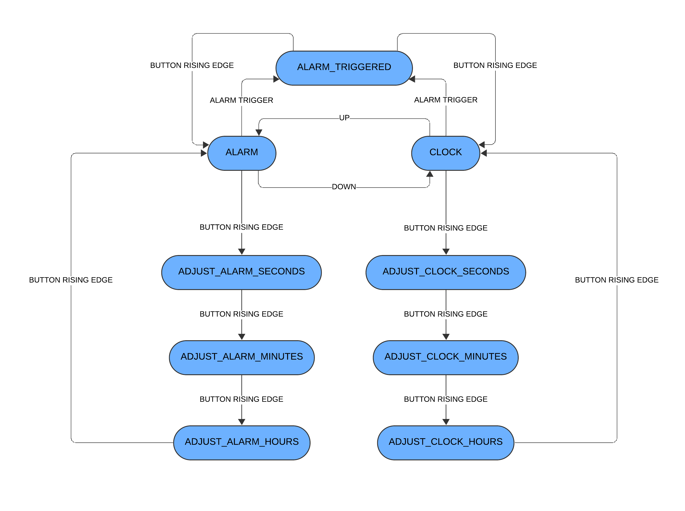

# Arduino Alarm Clock

A modular Arduino Mega 2560 alarm clock that uses a Finite State Machine (FSM) to manage its operations. User input is handled by a 2-axis joystick with a built-in button, and feedback is provided on a 16x2 character LCD. 

This project is built with a focus on modularity and non-blocking code, using hardware timers for both the clock and the alarm buzzer.

## Features

  * **Time Display**: Shows the current time in HH:MM:SS format.
  * **Time Adjustment**: Set the current time using the joystick.
      * **Up/Down**: Increment/decrement the value by 1.
      * **Right/Left**: Increment/decrement the value by 10 (for faster setting).
  * **Alarm**: Set a daily alarm time. The alarm screen shows "DISABLED" if no alarm is set.
  * **Alarm Melody**: Plays a non-blocking, customizable melody when the alarm is triggered.
  * **Alarm Control**: The alarm can be silenced by pressing the joystick button.
  * **State-Driven UI**: The entire application is managed by a simple Finite State Machine (FSM), making the code easy to read and extend.

## Hardware Requirements

  * Arduino Mega 2560
  * 16x2 LiquidCrystal LCD Display (connected in 4-bit mode)
  * 10k&Omega; potentiometer (to adjust the LCD contrast)
  * 220&Omega; resistor (to limit the current for the backlight)
  * KY-023 Joystick module (or equivalent 2-axis analog joystick with digital button)
  * Piezo Buzzer module (passive)
  * Breadboard and jumper wires

## Arduino Libraries

  * [**Arduino-TimerInterrupt**](https://docs.arduino.cc/libraries/timerinterrupt) by Khoi Hoang (used v1.8.0)
  * [**LiquidCrystal**](https://www.arduino.cc/en/Reference/LiquidCrystal)  by Arduino and Adafruit (used v1.0.7)

## Project Structure

The source code is organized into modular components:

  * `main.ino`: Contains the main `setup()` and `loop()` functions, the Finite State Machine (FSM) logic, and hardware pin definitions with components usage.
  * `Joystick.hpp` / `.cpp`: A class to manage the joystick. It handles reading analog values, reading the digital button, software debouncing and detecting state changes like `is_rising_edge()` or `moved_from_to()`.
  * `Clock.hpp` / `.cpp`: A module that manages timekeeping and alarm logic. It uses `ITimer4` to create a 1Hz interrupt that increments the time precisely.
  * `Buzzer.hpp` / `.cpp`: A module for playing melodies. It uses `ITimer3` to play notes at a set BPM without using `delay()`, allowing the rest of the code to run uninterrupted.
  * `timers.hpp` / `.cpp`: A helper file to hold TimerInterrupt library implementation and extern the timer instances (`ITimer3` and `ITimer4`) for use across the project.
  * `debug.hpp`: A simple header containing a `LOG()` macro for conditional serial debugging.

## How It Works

### Finite State Machine (FSM)

The core of the application is a `switch` statement inside the `loop()` function. It uses a `current_state` variable of type `state_t` to determine what to do.

The joystick's button `is_rising_edge()` and direction `moved_from_to()` are used to transition between states.

The primary states are:

  * `CLOCK`: Default state, displays time.
  * `ADJUST_CLOCK_SECONDS` / `MINUTES` / `HOURS`: States for setting the time.
  * `ALARM`: Displays the currently set alarm time.
  * `ADJUST_ALARM_SECONDS` / `MINUTES` / `HOURS`: States for setting the alarm.
  * `ALARM_TRIGGERED`: Entered when the alarm time is reached. Plays the buzzer and waits for user input to stop it.

### Non-Blocking Timers

This project relies heavily on hardware interrupts to avoid blocking the main loop:

1.  **Clock Timer (`ITimer4`):** The `Clock` module sets `ITimer4` to fire at `1.0f` Hz. The `clock_handler` interrupt service routine (ISR) increments the `current_seconds` counter. This guarantees that time is kept accurately, even if the main loop is busy or delayed.
2.  **Buzzer Timer (`ITimer3`):** The `Buzzer` module sets `ITimer3` to fire at a frequency based on the `BPM` (Beats Per Minute). The `buzzer_handler` ISR steps through the `melody` array, playing one note per interrupt. This allows complex melodies to play in the background while the LCD and joystick remain fully responsive.